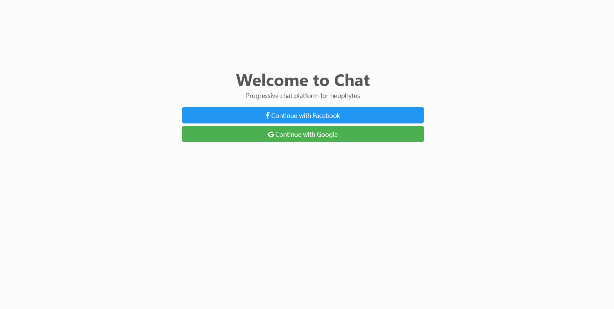
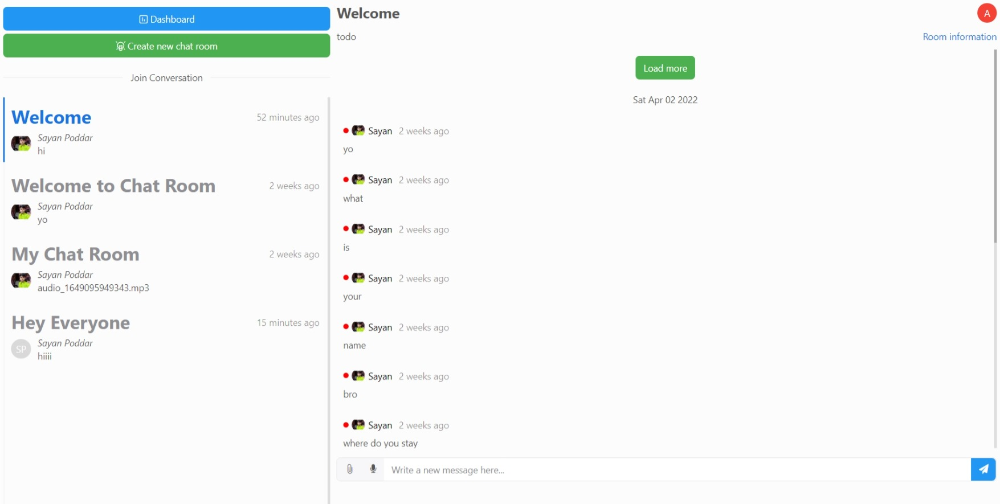
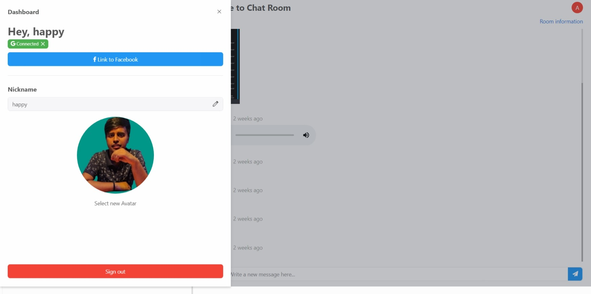

# Chat app

## Table of contents

- [Overview](#overview)
  - [The challenge](#the-challenge)
  - [Screenshot](#screenshot)
  - [Links](#links)
- [My process](#my-process)
  - [Built with](#built-with)
  - [What I learned](#what-i-learned)
  - [Deployment](#deployment)
  - [Useful resources](#useful-resources)
- [Author](#author)

## Overview

### The challenge

To build a responsive Chat app using React. Here users can chat with their friends by sigining using their mail id or facebook . User can create their own chat room, chat room can be administered by their owner who have created it. Except text messages user can send audio messages, can record audio, can send images. Any many other features are there. 

### Screenshot

### Links

- Live Site URL: [Click Here](https://chat-web-app-fe28e.web.app/)

## My process

### Built with

- Semantic HTML5 markup
- React
- styled-component
- firebase

### What I learned

I learned how to use React to make responsive applications. And learned how to use React router dom for dynamic routing, 
I have used styled-component library to style my application. I have used firebase to develop the backend part for storing the realtime data and hosting the project.

### Deployment

#### Deploy Locally

1. Clone this repo by running git clone `https://github.com/DecodewithHappy/box-office.git`
2. Install dependencies by running npm install
3. Run npm run start

### Useful resources

- [Adobe Color](https://color.adobe.com/create/color-wheel) - This is a very good resource to get a varieties of color . I really liked the color wheel and will use it going forward.
- [Font Awesome](https://fontawesome.com/) - Here we can get several icons, logos which can be used in various places.
- [Google Fonts](https://fonts.google.com/) - A good resource through which we can get different types of fonts.
- [React Docs](https://reactjs.org/) - Official documentation of ReactJs
- [Firebase Docs](https://firebase.google.com/docs) - Official documntation of Firebase

## Author

- Website - [Sayan Poddar](https://github.com/DecodewithHappy/TicTacToe-Game)
- Frontend Mentor - [@DecodewithHappy](https://www.frontendmentor.io/profile/DecodewithHappy)
- Linkedin - [@SayanPoddar](https://www.linkedin.com/in/sayan-poddar-71777222a/)
